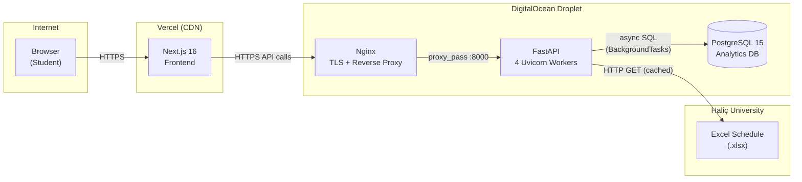

<div align="center">

# Haliç Exam Genius Pro

**The production-grade evolution of the original Exam Genius, rebuilt for performance and scale.**

> A complete rewrite of the initial [`halic-exam-genius`](https://github.com/eftekin/halic-exam-genius) project, introducing containerization, asynchronous logging, and robust analytics.


</div>

---

## Key Features

| Feature                       | Description                                                                           |
| ----------------------------- | ------------------------------------------------------------------------------------- |
| **Smart Multi-Select Search** | Fuzzy matching by course code, name, acronym, or word prefixes                        |
| **ICS Calendar Export**       | RFC 5545 `.ics` with `VTIMEZONE` — works on iOS, Android, macOS, and Outlook          |
| **PNG Image Export**          | DOM-to-PNG at 2× resolution via `html-to-image` with Web Share API fallback           |
| **Bilingual (TR / EN)**       | Auto-detects browser locale with full translation dictionaries                        |
| **Dark Mode**                 | Automatic theme switching via `prefers-color-scheme`                                  |
| **Analytics Pipeline**        | Every search logged to PostgreSQL via background tasks — zero response latency impact |

---

## Tech Stack

**Frontend:** Next.js 16 · React 19 · TypeScript 5 · Tailwind CSS 4 · html-to-image · Lucide React

**Backend:** FastAPI · Pydantic v2 · Pandas · SQLModel + asyncpg · Uvicorn (4 workers)

**Infrastructure:** Docker Compose · Nginx (TLS + reverse proxy) · Let's Encrypt · Vercel · DigitalOcean

---

## Cloud Architecture



### Data Flow

1. **Student** opens the app → Vercel serves Next.js over HTTPS.
2. **Frontend** calls `POST /api/schedule` → hits the Nginx reverse proxy on DigitalOcean.
3. **Nginx** terminates TLS and forwards to FastAPI on port 8000.
4. **FastAPI** checks the in-memory cache (TTL 1 h). On miss, downloads the `.xlsx`, parses it with Pandas, and caches the result.
5. **Background task** logs each course search to PostgreSQL via `asyncpg` — never blocks the response.
6. **Response** flows back: FastAPI → Nginx → Vercel CDN → Browser.

---

## Why Pro?

| Enhancement          | Detail                                                                                                     |
| -------------------- | ---------------------------------------------------------------------------------------------------------- |
| **Containerized**    | Fully Dockerized stack with Nginx as a TLS/reverse proxy — one `docker compose up -d` to deploy everything |
| **High Performance** | FastAPI serving 4 Uvicorn workers with async PostgreSQL operations via `asyncpg`                           |
| **Data Driven**      | Real-time search analytics and faculty-based usage tracking, logged in the background                      |
| **Reliable**         | Automated SSL via Certbot, health checks, and background task processing                                   |

---

## Project Structure

```
halic-exam-genius-pro/
├── backend/
│   ├── main.py                  # ASGI entry point, CORS, router mount
│   ├── Dockerfile               # Multi-stage build, non-root user
│   ├── docker-compose.yml       # API + PostgreSQL + Nginx
│   ├── nginx.conf               # Reverse proxy, TLS, security headers
│   └── app/
│       ├── config.py            # Pydantic Settings (env-driven)
│       ├── database.py          # Async engine, session factory
│       ├── models/              # Pydantic schemas + SQLModel tables
│       ├── routes/              # API endpoints with BackgroundTasks
│       └── services/            # Excel parsing, ICS gen, analytics logger
├── frontend/
│   └── src/
│       ├── app/                 # Root layout, page, global CSS
│       ├── components/          # CourseSelector, ExamCard, ExportBar…
│       ├── config/constants.ts  # Semester & exam-type config
│       └── lib/                 # API client, i18n, calendar helpers
└── README.md
```

---

## Quick Start

### Backend

```bash
cd backend
python -m venv .venv && source .venv/bin/activate
pip install -r requirements.txt
uvicorn main:app --reload --port 8000
```

### Frontend

```bash
cd frontend
npm install
npm run dev
```

### Docker (Production)

```bash
cd backend
cp .env.example .env          # configure your secrets
docker compose up -d --build
```

---

## License

[MIT](LICENSE)
