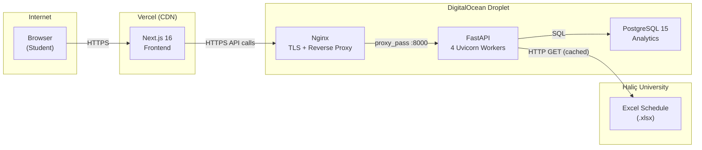

# Haliç Exam Genius Pro


A production-ready exam schedule platform built for **3 000+ Haliç University students**. Select your courses, instantly view exam dates and classrooms, export everything to your calendar, and share a clean PNG image — all from a single, mobile-first interface.

**Live:** [halicexamgenius.app](https://www.halicexamgenius.app)

---

## Overview

Every semester, Haliç University publishes a massive Excel spreadsheet containing thousands of exam entries. Students must manually search rows, cross-reference codes, and note down dates — a tedious, error-prone process.

**Exam Genius Pro** automates this entirely:

1. The backend fetches the official `.xlsx` file, parses and normalises 1 300+ course entries with Pandas.
2. Students search and multi-select their courses through a smart search UI (supports course codes, names, acronyms, and multi-word prefix matching).
3. Exam schedules are displayed as clean cards with date, time, and classroom information.
4. One tap exports all exams to Apple Calendar, Google Calendar, or Outlook via ICS, or generates a shareable PNG image.

---

## Key Features

| Feature                       | Description                                                                                                                      |
| ----------------------------- | -------------------------------------------------------------------------------------------------------------------------------- |
| **Smart Multi-Select Search** | Fuzzy matching by course code, full name, acronym, or word prefixes — find any course in under 2 keystrokes                      |
| **ICS Calendar Export**       | RFC 5545 compliant `.ics` file with `VTIMEZONE` support for Europe/Istanbul — opens natively on iOS, Android, macOS, and Outlook |
| **PNG Image Export**          | Server-rendered table captured at 2× pixel ratio via `html-to-image`, with native Web Share API fallback to download             |
| **Classroom Info**            | Room/building codes shown per exam so students know exactly where to go                                                          |
| **Dark Mode**                 | Automatic theme switching based on `prefers-color-scheme` with smooth, flash-free rendering                                      |
| **Bilingual (TR / EN)**       | Auto-detects browser locale; complete Turkish and English translation dictionaries                                               |
| **Mobile-First UX**           | iOS-quality interface with `safe-area-inset` support, sticky header, and bottom action bar                                       |

---

## Tech Stack

### Frontend

| Technology                  | Purpose                                                         |
| --------------------------- | --------------------------------------------------------------- |
| **Next.js 16** (App Router) | Server-side rendering, static optimisation, file-based routing  |
| **React 19**                | Concurrent rendering, `useCallback` / `useMemo` for performance |
| **TypeScript 5**            | End-to-end type safety across components and API layer          |
| **Tailwind CSS 4**          | Utility-first styling with CSS custom properties for theming    |
| **html-to-image**           | Client-side DOM-to-PNG capture for the export feature           |
| **Lucide React**            | Consistent, tree-shakeable icon system                          |

### Backend

| Technology                              | Purpose                                                         |
| --------------------------------------- | --------------------------------------------------------------- |
| **FastAPI 0.115**                       | High-performance async API with auto-generated OpenAPI docs     |
| **Pydantic v2** + **pydantic-settings** | Request/response validation and env-driven configuration        |
| **Pandas** + **OpenPyXL**               | Excel parsing, data grouping, and sorting of 1 300+ course rows |
| **Plotly** + **Kaleido**                | Server-side PNG table rendering for the image export endpoint   |
| **Uvicorn**                             | ASGI server with 4 workers behind Nginx reverse proxy           |

### Infrastructure

| Technology                      | Purpose                                                               |
| ------------------------------- | --------------------------------------------------------------------- |
| **Docker** + **Docker Compose** | Multi-container deployment (API + PostgreSQL + Nginx)                 |
| **Nginx**                       | TLS termination, HTTP→HTTPS redirect, security headers, reverse proxy |
| **Let's Encrypt** (Certbot)     | Automated SSL certificate provisioning and renewal                    |
| **Vercel**                      | Frontend hosting with edge CDN and automatic deployments              |
| **DigitalOcean**                | Backend VPS running the Dockerised API stack                          |

---

## Architecture



### Data Flow

1. **Student** opens the app → Vercel serves the Next.js frontend over HTTPS.
2. **Frontend** calls `POST /api/schedule` → request hits the Nginx reverse proxy on the DigitalOcean droplet.
3. **Nginx** terminates TLS and forwards to the FastAPI backend on port 8000.
4. **FastAPI** checks the in-memory cache (TTL: 1 hour). On cache miss, it downloads the `.xlsx` from Haliç University, parses it with Pandas, and caches the processed DataFrame.
5. **Response** flows back: FastAPI → Nginx → Vercel CDN → Browser.

---

## Project Structure

```
halic-exam-genius-pro/
├── backend/
│   ├── main.py                  # ASGI entry point, CORS, router mount
│   ├── Dockerfile               # Multi-stage build, non-root user
│   ├── docker-compose.yml       # API + PostgreSQL + Nginx
│   ├── nginx.conf               # Reverse proxy + TLS + security headers
│   ├── requirements.txt         # Python dependencies
│   ├── .env.example             # Environment variable template
│   └── app/
│       ├── config.py            # Pydantic Settings (env-driven)
│       ├── models/exam.py       # Request / response schemas
│       ├── routes/exam.py       # API endpoints
│       └── services/
│           └── exam_service.py  # Excel parsing, schedule builder,
│                                #   ICS generation, image export
├── frontend/
│   ├── package.json
│   ├── next.config.ts
│   └── src/
│       ├── app/                 # Root layout, page, global CSS
│       ├── components/          # CourseSelector, ExamCard, ExportBar,
│       │                        #   ExportView, States
│       ├── config/constants.ts  # Semester & exam-type config
│       └── lib/                 # API client, i18n, calendar helpers
├── LICENSE
└── README.md
```

---

## Quick Start

### Prerequisites

- **Python** 3.11+
- **Node.js** 20+
- **npm** (or yarn / pnpm)

### Backend

```bash
cd backend

# Create & activate virtual environment
python -m venv .venv && source .venv/bin/activate

# Install dependencies
pip install -r requirements.txt

# Start the dev server
uvicorn main:app --reload --port 8000
```

API docs available at [localhost:8000/docs](http://localhost:8000/docs) (Swagger UI).

### Frontend

```bash
cd frontend

# Install dependencies
npm install

# Start the dev server
npm run dev
```

App available at [localhost:3000](http://localhost:3000).

---

## Docker Deployment

Production deployment with Docker Compose (API + PostgreSQL + Nginx):

```bash
cd backend

# 1. Create environment file from template
cp .env.example .env
# Edit .env with real values (SECRET_KEY, CORS_ORIGINS, DB password)

# 2. Build and start all services
docker compose up -d --build

# 3. Verify
curl http://localhost/health
# → {"status":"healthy"}
```

Three containers are orchestrated:

| Container           | Image                     | Role                                             |
| ------------------- | ------------------------- | ------------------------------------------------ |
| `exam-genius-api`   | Custom (Python 3.11 slim) | FastAPI with 4 Uvicorn workers, non-root user    |
| `exam-genius-db`    | `postgres:15-alpine`      | Persistent data volume, health-checked           |
| `exam-genius-nginx` | `nginx:alpine`            | TLS termination, security headers, reverse proxy |

---

## Configuration

### Environment Variables

All backend settings use the `EXAM_GENIUS_` prefix and are managed by Pydantic Settings.
Copy `.env.example` → `.env` and fill in real values. **Never commit `.env`.**

| Variable                        | Description                        | Default                     |
| ------------------------------- | ---------------------------------- | --------------------------- |
| `EXAM_GENIUS_SECRET_KEY`        | Random secret for internal signing | _(required in production)_  |
| `EXAM_GENIUS_CORS_ORIGINS`      | Allowed origins (JSON array)       | `["http://localhost:3000"]` |
| `EXAM_GENIUS_EXAM_SCHEDULE_URL` | URL to the university `.xlsx` file | Haliç CDN URL               |
| `EXAM_GENIUS_DATABASE_URL`      | PostgreSQL connection string       | —                           |
| `EXAM_GENIUS_CACHE_TTL_SECONDS` | In-memory cache TTL (seconds)      | `3600`                      |

Frontend (set in Vercel dashboard or `.env.local`):

| Variable              | Description          | Default                 |
| --------------------- | -------------------- | ----------------------- |
| `NEXT_PUBLIC_API_URL` | Backend API base URL | `http://localhost:8000` |

### Semester Update

Each semester, update two values:

1. **Backend** — Set `EXAM_GENIUS_EXAM_SCHEDULE_URL` to the new `.xlsx` link (env var or `app/config.py`)
2. **Frontend** — Update academic year, semester, and exam type in `frontend/src/config/constants.ts`

---

## API Reference

| Method | Endpoint                | Description                            |
| ------ | ----------------------- | -------------------------------------- |
| `GET`  | `/api/courses`          | List all 1 300+ available courses      |
| `POST` | `/api/schedule`         | Get exam schedule for selected courses |
| `POST` | `/api/export/ics`       | Download ICS calendar file             |
| `POST` | `/api/export/image`     | Download PNG schedule image            |
| `POST` | `/api/cache/invalidate` | Force-refresh cached exam data         |
| `GET`  | `/health`               | Health check                           |

Full interactive documentation is available at `/docs` (Swagger UI) when running the backend.

---

## Security

- **No secrets in source code** — all credentials are loaded from environment variables via Pydantic Settings
- **Non-root container** — the API runs as `appuser` (UID 1000) inside Docker
- **TLS everywhere** — Nginx terminates HTTPS with Let's Encrypt certificates; HTTP traffic is 301-redirected
- **Security headers** — `X-Frame-Options`, `X-Content-Type-Options`, `Strict-Transport-Security`, `Referrer-Policy`, and `Permissions-Policy` are set on every response
- **CORS** — restricted to configured origin domains only
- **Internal-only ports** — PostgreSQL (5432) and the API (8000) are not exposed to the host; only Nginx ports 80/443 are public

---

## License

This project is licensed under the [MIT License](LICENSE).

## Author

**Mustafa Eftekin** — [github.com/eftekin](https://github.com/eftekin)
