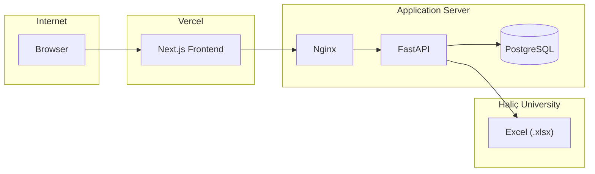

<div align="center">

# Haliç Exam Genius Pro

**The production-grade evolution of the original Exam Genius, rebuilt for performance and scale.**

> A complete rewrite of the initial [`halic-exam-genius`](https://github.com/eftekin/halic-exam-genius) project, introducing containerization, asynchronous logging, and robust analytics.

A production-grade exam schedule application for Haliç University. Students search courses, export schedules to calendar (ICS) or image (PNG), with full Turkish/English support and optional analytics.


</div>

---

## Table of Contents

- [Features](#features)
- [Tech Stack](#tech-stack)
- [Architecture](#architecture)
- [Getting Started](#getting-started)
- [Configuration](#configuration)
- [Deployment](#deployment)
- [Project Structure](#project-structure)
- [License](#license)

---

## Features

| Feature | Description |
|--------|-------------|
| **Multi-select search** | Fuzzy search by course code, name, or acronym. |
| **ICS export** | RFC 5545 calendar files with `VTIMEZONE` (iOS, Android, Outlook). |
| **PNG export** | Schedule as image at 2× resolution; Web Share API when available. |
| **Bilingual (TR/EN)** | Locale-aware UI with full translation. |
| **Dark mode** | Follows `prefers-color-scheme`. |
| **Analytics** | Search events logged to PostgreSQL via background tasks. |

---

## Tech Stack

| Layer | Technologies |
|-------|--------------|
| **Frontend** | Next.js 16, React 19, TypeScript 5, Tailwind CSS 4, html-to-image, Lucide React |
| **Backend** | FastAPI, Pydantic v2, Pandas, SQLModel + asyncpg, Uvicorn (4 workers) |
| **Infrastructure** | Docker Compose, Nginx (TLS + reverse proxy), Let’s Encrypt; frontend on Vercel |

---

## Architecture



- **Frontend** (Vercel): Serves the Next.js app over HTTPS.
- **Backend** (Docker): Nginx terminates TLS and proxies to FastAPI; FastAPI caches the Excel schedule in memory (configurable TTL) and logs analytics to PostgreSQL in the background.
- **Data**: Schedule URL is configured in code; no need to set it in server `.env` (see [Configuration](#configuration)).

---

## Getting Started

### Prerequisites

- Node.js 20+, Python 3.11+, Docker & Docker Compose (for full stack).

### Backend (local)

```bash
cd backend
python -m venv .venv
source .venv/bin/activate   # Windows: .venv\Scripts\activate
pip install -r requirements.txt
uvicorn main:app --reload --port 8000
```

### Frontend (local)

```bash
cd frontend
npm install
npm run dev
```

Set the frontend API base URL via environment (e.g. `NEXT_PUBLIC_API_URL=http://localhost:8000` if needed).

### Full stack with Docker

```bash
cd backend
cp .env.example .env
# Edit .env: set EXAM_GENIUS_SECRET_KEY, EXAM_GENIUS_CORS_ORIGINS, POSTGRES_*, EXAM_GENIUS_DATABASE_URL
docker compose up -d --build
```

The API runs behind Nginx on port 80 (and 443 if TLS is configured). Do **not** set `EXAM_GENIUS_EXAM_SCHEDULE_URL` in `.env`; the schedule URL is defined in code (see below).

---

## Configuration

Semester and exam schedule are controlled in two places only. You do **not** need to change server `.env` for the schedule URL.

| What | File | Purpose |
|------|------|--------|
| **Excel schedule URL** | `backend/app/config.py` | URL of the official `.xlsx` schedule. Update here when the university publishes a new file; deploy to apply. |
| **Semester labels & exam type** | `frontend/src/config/constants.ts` | Academic year, semester name (e.g. Güz/Fall), exam type (e.g. Vize/Midterm). Update when the exam period changes. |

- **Backend**: Edit `exam_schedule_url` in `backend/app/config.py`, then commit and push. The deploy workflow builds a new image and recreates containers; the app uses the value from code.
- **Frontend**: Edit `frontend/src/config/constants.ts` (e.g. `ACADEMIC_YEAR`, `SEMESTER_TR`, `EXAM_TYPE_TR`) and deploy the frontend (e.g. Vercel).

All other backend settings (secret key, CORS, database URL, cache TTL, sync interval) remain in `.env` as in `.env.example`.

**Automated sync**: The backend runs a background task that checks the Excel URL for changes (via `HEAD` requests, comparing `ETag`/`Last-Modified`). When the file changes, the cache is invalidated so the next request fetches fresh data. Set `EXAM_GENIUS_SYNC_CHECK_INTERVAL_SECONDS` (default 1800 = 30 min) to control the check frequency; set to `0` to disable.

---

## Deployment

### Backend (GitHub Actions)

Pushes to `main` that touch `backend/**` or `backend/app/config.py` trigger an automated deploy:

1. SSH to the server, `git pull`, then from `backend/`: clear optional cached `.xlsx` files, run `docker compose up -d --build --force-recreate`, optional DB table refresh, then health check against `/health`.

**Required secrets:**

- `SERVER_HOST` — Server hostname or IP
- `SSH_PRIVATE_KEY` — Private key for SSH (e.g. `root@SERVER_HOST`)

**Optional:**

- `REFRESH_DB_TABLES` — Comma-separated table names to truncate on deploy (e.g. `search_logs,faculty_analytics`) when the Excel structure or semester changes.

The workflow file: `.github/workflows/deploy.yml`.

### Frontend

Deploy the `frontend/` app to Vercel (or your chosen host). Point `NEXT_PUBLIC_API_URL` to your backend (e.g. `https://your-api-domain.com`). Ensure backend CORS allows that origin in `EXAM_GENIUS_CORS_ORIGINS`.

---

## Project Structure

```
halic-exam-genius-pro/
├── backend/
│   ├── main.py              # ASGI app, CORS, routes
│   ├── Dockerfile           # Multi-stage build
│   ├── docker-compose.yml   # API, PostgreSQL, Nginx
│   ├── nginx.conf           # Reverse proxy, TLS
│   └── app/
│       ├── config.py        # Settings (exam_schedule_url lives here)
│       ├── database.py      # Async PostgreSQL
│       ├── models/          # Pydantic schemas, SQLModel
│       ├── routes/          # API endpoints
│       └── services/        # Excel, ICS, analytics
├── frontend/
│   └── src/
│       ├── app/             # Next.js app router
│       ├── components/      # UI components
│       ├── config/
│       │   └── constants.ts # Semester & exam-type labels
│       └── lib/             # API client, i18n, utils
└── .github/workflows/
    └── deploy.yml           # Backend deploy workflow
```

---

## License

[MIT](LICENSE)
